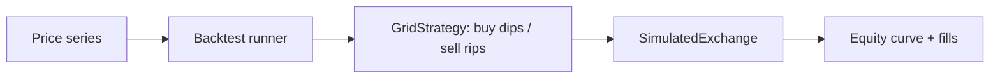

<p align="center">
  
</p>

<h1 align="center">Grid Trading Bot</h1>

<p align="center">
  <strong>Grid trading bot with a configurable price grid, simulated exchange, and backtest — in Python.</strong><br>
  Lay a price ladder, buy the dips and sell the rips, then backtest the whole thing risk-free.
</p>

<p align="center">
  <em>Built and maintained by <a href="https://viprasol.com">Viprasol Tech</a> — Fintech Experts. Full-Stack Builders.</em>
</p>

<p align="center">
  <a href="https://github.com/Viprasol-Tech/grid-trading-bot/actions/workflows/ci.yml"></a>
  <a href="LICENSE"></a>
  
  <a href="https://t.me/viprasol_help"></a>
  <a href="https://github.com/Viprasol-Tech/grid-trading-bot/stargazers"></a>
</p>

---

> ## ⚠️ Disclaimer
> This software is for **educational purposes only** and is **not financial advice**. Trading is highly volatile and involves substantial risk, including the **total loss of capital**. Backtest results are **not** indicative of future performance. Always test on the simulated exchange first and comply with each exchange's terms and your local laws. **Use at your own risk** — Viprasol Tech assumes no responsibility for your trading results.

---

## ✨ Features

- 📐 **Configurable price grid** — `GridStrategy(lower, upper, levels, quantity)` with validated parameters.
- 📉 **Buy on dip, 📈 sell on rise** — places buys as price falls through grid lines and sells as it rises.
- 🏜️ **Simulated exchange included** — base/quote balances, proportional fees, no API keys or risk.
- 🔁 **Backtest runner** — replay any price series for final equity, fill count, and an equity curve.
- 🖥️ **CLI** — `grid-trading-bot demo` runs the whole pipeline on a synthetic sine series.
- ⚙️ **Modern tooling** — ruff, mypy (strict), pytest, GitHub Actions CI.

## 🚀 Quickstart

```bash
git clone https://github.com/Viprasol-Tech/grid-trading-bot.git
cd grid-trading-bot
python -m pip install -e ".[dev]"

# Run a grid backtest on synthetic data:
grid-trading-bot demo
grid-trading-bot demo --lower 90 --upper 110 --levels 9 --quantity 0.5
```

## 🧩 Use it in code

```python
from grid_trading_bot.backtest import run_backtest
from grid_trading_bot.exchange import SimulatedExchange
from grid_trading_bot.grid import GridStrategy

prices = [100, 95, 90, 95, 100, 105, 110]
exchange = SimulatedExchange(balances={"USDT": 10_000.0}, fee_rate=0.001)
strategy = GridStrategy(lower=85, upper=115, levels=13, quantity=1.0)

result = run_backtest("BTC/USDT", prices, strategy, exchange)
print(result.num_fills, f"${result.final_equity:,.2f}", f"{result.return_pct:+.2f}%")
```

## 🏗️ Architecture



## 🗺️ Roadmap

- [x] Configurable grid strategy with parameter validation
- [x] Simulated exchange with fees + backtest runner and equity curve
- [ ] Trailing / dynamic grids that re-center on trend
- [ ] Live exchange adapters (ccxt)
- [ ] Equity-curve plotting and performance metrics

## 🤝 Contributing

PRs welcome — see [CONTRIBUTING.md](CONTRIBUTING.md) and our [Code of Conduct](CODE_OF_CONDUCT.md).

## Contact — Viprasol Tech Private Limited

- Website: [viprasol.com](https://viprasol.com)
- Email: [support@viprasol.com](mailto:support@viprasol.com)
- Telegram: [t.me/viprasol_help](https://t.me/viprasol_help) | WhatsApp: +91 96336 52112
- GitHub: [@Viprasol-Tech](https://github.com/Viprasol-Tech) | [LinkedIn](https://www.linkedin.com/in/viprasol/) | X [@viprasol](https://twitter.com/viprasol)

> *Viprasol Tech — fintech software, algorithmic trading systems, MT4/MT5 bots, AI voice agents, and B2B SaaS. Need a custom build? [Get in touch](mailto:support@viprasol.com).*

## License

[MIT](LICENSE) (c) 2025 Viprasol Tech Private Limited
