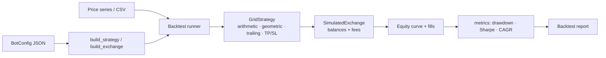

<p align="center">
  
</p>

<h1 align="center">Grid Trading Bot</h1>

<p align="center">
  <strong>Arithmetic & geometric grid trading bot with risk bounds, a trailing grid, a simulated exchange, and a full backtest report — in Python.</strong><br>
  Lay a price ladder, buy the dips and sell the rips, then backtest the whole thing risk-free with PnL, drawdown, and Sharpe.
</p>

<p align="center">
  <em>Built and maintained by <a href="https://viprasol.com">Viprasol Tech</a> — Fintech Experts. Full-Stack Builders.</em>
</p>

<p align="center">
  <a href="https://github.com/Viprasol-Tech/grid-trading-bot/actions/workflows/ci.yml"></a>
  <a href="LICENSE"></a>
  
  
  
  
  
  <a href="https://t.me/viprasol_help"></a>
  <a href="https://github.com/Viprasol-Tech/grid-trading-bot/stargazers"></a>
</p>

---

> ## ⚠️ Disclaimer
> This software is for **educational purposes only** and is **not financial advice**. Trading is highly volatile and involves substantial risk, including the **total loss of capital**. Backtest results are **not** indicative of future performance. Always test on the simulated exchange first and comply with each exchange's terms and your local laws. **Use at your own risk** — Viprasol Tech assumes no responsibility for your trading results.

---

## ✨ Features

- 📐 **Arithmetic _and_ geometric grids** — equal-price spacing or log-spaced (equal-percentage) levels, ideal for assets that move in percentage terms.
- 📉 **Buy on dip, 📈 sell on rise** — places buys as price falls through grid lines and sells as it rises.
- 🎯 **Take-profit & stop-loss bounds** — liquidate inventory once and go dormant on a breakout so a runaway move doesn't bleed the grid.
- 🪜 **Trailing grid** — slide the whole ladder up to re-center on a breakout and ride an uptrend instead of selling out at the top.
- 📊 **Rich backtest report** — final equity, PnL, fill counts (buy/sell), fees paid, **max drawdown**, **Sharpe ratio**, and CAGR.
- 🏜️ **Simulated exchange included** — base/quote balances, proportional fees, no API keys or risk.
- ⚙️ **Declarative config** — describe a run in a validated JSON file (`BotConfig`) and share/version it.
- 🖥️ **CLI subcommands** — `demo`, `backtest`, `init-config`, and `version`; feed your own price CSV.
- 🧪 **Modern tooling** — ruff, mypy (strict), 60 pytest cases, GitHub Actions CI.

## 🚀 Quickstart

```bash
git clone https://github.com/Viprasol-Tech/grid-trading-bot.git
cd grid-trading-bot
python -m pip install -e ".[dev]"

# Run a grid backtest on synthetic data:
grid-trading-bot demo
grid-trading-bot demo --spacing geometric --levels 11

# Generate a config, edit it, then backtest from it (optionally on your prices):
grid-trading-bot init-config grid.json
grid-trading-bot backtest grid.json
grid-trading-bot backtest grid.json --prices my_prices.csv
```

## 🧩 Use it in code

```python
from grid_trading_bot.backtest import run_backtest
from grid_trading_bot.exchange import SimulatedExchange
from grid_trading_bot.grid import GridSpacing, GridStrategy

prices = [100, 95, 90, 95, 100, 105, 110]
exchange = SimulatedExchange(balances={"USDT": 10_000.0}, fee_rate=0.001)

# A log-spaced grid with a stop-loss and a trailing top.
strategy = GridStrategy(
    lower=85,
    upper=115,
    levels=13,
    quantity=1.0,
    spacing=GridSpacing.GEOMETRIC,
    stop_loss=80.0,
)

result = run_backtest("BTC/USDT", prices, strategy, exchange)
print(f"Fills: {result.num_fills}  PnL: {result.pnl:+.2f}")
print(f"Max DD: {result.max_drawdown_pct:.2f}%  Sharpe: {result.sharpe():.2f}")
```

Or load everything from a config file:

```python
from grid_trading_bot.config import BotConfig
from grid_trading_bot.backtest import run_backtest

cfg = BotConfig.from_file("grid.json")
result = run_backtest(cfg.symbol, prices, cfg.build_strategy(), cfg.build_exchange(), cfg.quote)
```

## 🏗️ Architecture



## 📚 API & features

| Component | What it does |
| --- | --- |
| `GridStrategy` | Core grid; `spacing`, `take_profit`, `stop_loss`, `trailing` controls. |
| `GridSpacing` | `ARITHMETIC` (equal price) or `GEOMETRIC` (log-spaced) levels. |
| `SimulatedExchange` | In-memory exchange with balances, proportional fees, and equity marking. |
| `run_backtest` | Replays a price series and returns a `BacktestResult`. |
| `BacktestResult` | `pnl`, `return_pct`, `num_buys/num_sells`, `total_fees`, `max_drawdown_pct`, `sharpe()`, `cagr_pct()`. |
| `BotConfig` | Validated, JSON-serialisable run config with `build_strategy()` / `build_exchange()`. |
| `metrics` | Pure functions: `returns`, `max_drawdown`, `sharpe_ratio`, `cagr`. |
| CLI | `demo` · `backtest` · `init-config` · `version`. |

## 🗺️ Roadmap

- [x] Configurable grid strategy with parameter validation
- [x] Simulated exchange with fees + backtest runner and equity curve
- [x] Geometric (log-spaced) grids alongside arithmetic
- [x] Take-profit / stop-loss bounds and a trailing grid
- [x] Backtest report with PnL, fills, drawdown, and Sharpe
- [x] JSON config + CLI subcommands
- [ ] Equity-curve plotting and HTML report export
- [ ] Live exchange adapters (ccxt)
- [ ] Parameter sweeps / grid optimisation

## ❓ FAQ

**Arithmetic or geometric — which grid should I use?**
Arithmetic spaces levels by equal price; geometric spaces them by equal ratio. Geometric is usually a better fit for crypto and other assets that move in percentage terms over wide ranges.

**What does the trailing grid do?**
When price breaks above the grid's top, the whole ladder slides up to re-center on the new price, so the bot keeps trading in an uptrend instead of selling its entire position at the top. It can't be combined with a take-profit (they contradict each other).

**Does this trade real money?**
No. It ships with a simulated exchange for paper trading and backtests only. Live adapters are on the roadmap.

**Where do prices come from?**
Bring your own: pass a one-price-per-line CSV with `--prices`, or use the built-in synthetic sine series for demos.

## 🤝 Contributing

PRs welcome — see [CONTRIBUTING.md](CONTRIBUTING.md) and our [Code of Conduct](CODE_OF_CONDUCT.md).

## Contact — Viprasol Tech Private Limited

- Website: [viprasol.com](https://viprasol.com)
- Email: [support@viprasol.com](mailto:support@viprasol.com)
- Telegram: [t.me/viprasol_help](https://t.me/viprasol_help) | WhatsApp: +91 96336 52112
- GitHub: [@Viprasol-Tech](https://github.com/Viprasol-Tech) | [LinkedIn](https://www.linkedin.com/in/viprasol/) | X [@viprasol](https://twitter.com/viprasol)

> *Viprasol Tech — fintech software, algorithmic trading systems, MT4/MT5 bots, AI voice agents, and B2B SaaS. Need a custom build? [Get in touch](mailto:support@viprasol.com).*

## License

[MIT](LICENSE) (c) 2025 Viprasol Tech Private Limited
